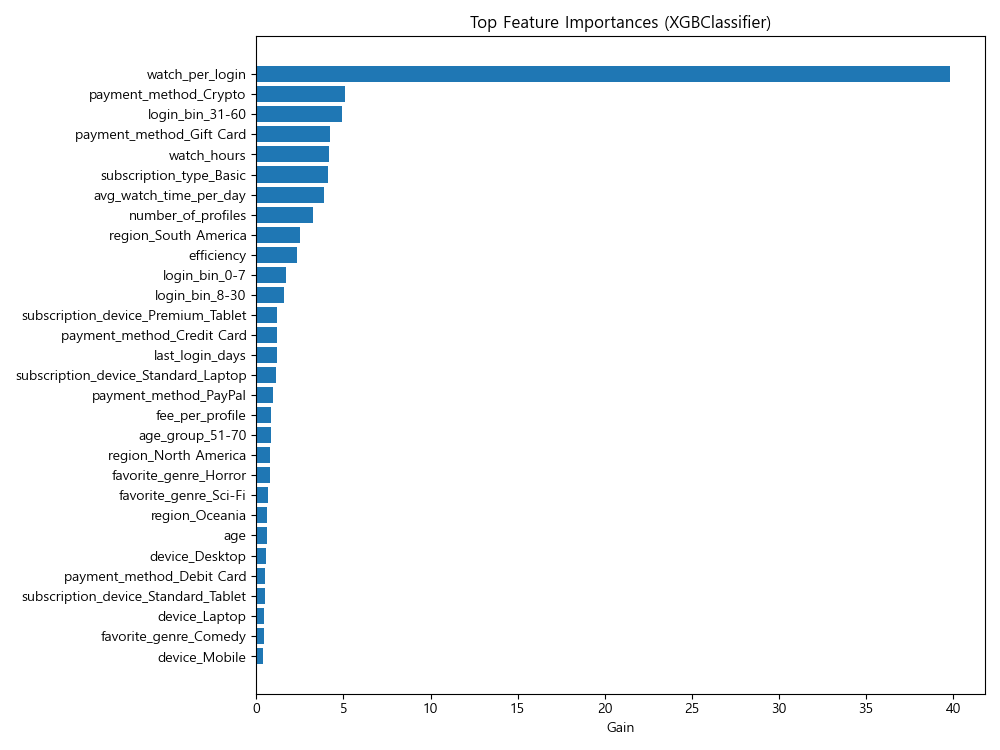

# 고객 이탈(Churn) 분석 리포트

## 📊 데이터 개요
- **Train 데이터**: 3,500행 × 14열  
- **Test 데이터**: 1,500행 × 14열
- **Target 변수**: `churned` (고객 이탈 여부, 0=잔존, 1=이탈)  
- **특징**: 결측치 없음, 타깃 분포 균형 (0/1 ≈ 50:50)  

---

## 🧾 컬럼 요약
- **ID 컬럼**
  - `customer_id`: 전부 유니크 → 모델 학습 불필요 (제거)
- **수치형**
  - `age`, `watch_hours`, `last_login_days`, `monthly_fee`,  
    `number_of_profiles`, `avg_watch_time_per_day`, `churned`
- **범주형**
  - `gender`, `subscription_type`, `region`, `device`,  
    `payment_method`, `favorite_genre`

---

## 📈 주요 통계
- **연령(age)**: 평균 43.6세, 분포 18–70세 (고르게 분포)  
- **시청시간(watch_hours)**: 평균 11.6시간, 최대 101시간 → 꼬리 긴 분포  
- **최근 로그인(last_login_days)**: 평균 30일, 범위 0–60일 → 로그인 간격 다양  
- **월 요금(monthly_fee)**: 8.99 / 13.99 / 17.99 → 구간형 요금제  
- **프로필 수(number_of_profiles)**: 1–5개, 평균 3개  
- **일평균 시청시간(avg_watch_time_per_day)**: 평균 0.89시간, 최대 98시간 → 일부 이상치 존재  
- **이탈률(churned)**: 약 50.3% → 균형 데이터  

---

## 🖼️ 시각화 결과

### 🎯 타깃 분포

### 📉 결측치 분포

### 👥 연령 분포

### 📊 이탈 여부별 연령 분포
  
➡️ 연령 자체로는 churn 구분력이 크지 않음. 다만 일부 구간(20대 초반, 60대 초반)에서 이탈률이 약간 높음.

---

### 📺 시청 시간 분포

### ⏳ 이탈 여부별 시청 시간
  
➡️ 이탈 고객은 시청시간이 현저히 낮음 → **시청시간은 강력한 예측 요인**.

---

### 💲 구독 요금제별 이탈률
  
➡️ Basic 요금제 고객의 이탈률이 확연히 높음. Premium/Standard는 상대적으로 낮음.

---

### ✅ 최근 로그인 경과일 vs 이탈 여부
  
➡️ 최근 로그인일이 길수록 이탈 확률 ↑.  
“오래 로그인 안 한 고객 → 이탈 위험군”

---

### ⭐ XGBoost Feature Importances
  

➡️ 중요도 상위 피처:
- `avg_watch_time_per_day`, `watch_hours`
- `subscription_type_Basic`
- `payment_method_Crypto`, `payment_method_Gift Card`
- `last_login_days`

---

## 🔍 Feature Engineering
학습 성능 향상을 위해 다음과 같은 파생 피처를 추가:
- **행동 지표**
  - `watch_per_login` = 시청시간 ÷ 로그인일수  
  - `fee_per_profile` = 월요금 ÷ 프로필 수  
  - `efficiency` = 일평균 시청시간 ÷ 월요금  
- **로그 변환**
  - `log_watch_hours`, `log_avg_watch`  
- **구간화(Binning)**
  - `age_group` = (18–30, 31–50, 51–70)  
  - `login_bin` = (0–7일, 8–30일, 31–60일)  
- **교차 변수**
  - `subscription_device` = 요금제 × 디바이스  

---

## ✅ 분석 결론
1. **주요 이탈 요인**
   - 낮은 시청시간 (`watch_hours`, `avg_watch_time_per_day`, `watch_per_login`)  
   - 최근 로그인일수 ↑ (`last_login_days`, `login_bin`)  
   - Basic 요금제  
   - 특정 결제 방식 (Crypto, Gift Card)  
2. **덜 중요한 요인**
   - 단순 연령 (`age`)  
   - 단순 월 요금 (`monthly_fee`)  
3. **데이터 품질**
   - 결측치 없음, 클래스 불균형 없음 → 학습 환경 우수

---
