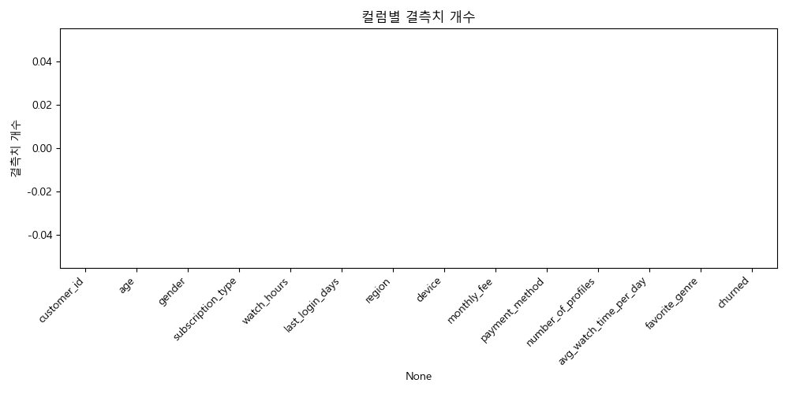

# 고객 이탈(Churn) 분석 리포트

## 팀원 소개
|  |  |  |  |  |
|----------------------------------------------------|----------------------------------------------------|----------------------------------------------------|---------------------------------------------------|---------------------------------------------------|
| 안시현                                                | 김규리                                                | 김민주                                                | 김주석                                                | 최준호                                               |

## 📊 데이터 개요

최근 K pop 데몬 헌터로 큰 성공을 이룬 넷플릭스는 OTT 시장에서 선두주자로 활약하고 있습니다.
그럼에도 불구하고 고객 이탈문제가가 심화되고 있어 골머리를 앓고 있습니다. 
이 프로젝트는 고객 데이터를 ML로 분석해 이탈 가능성이 높은 고객을 조기 식별해 이탈을 방지하는 것을 목표로 하고 있습니다

---

## 🧾 컬럼 요약
- **ID 컬럼**
  - `customer_id`: 전부 유니크 → 모델 학습 불필요 (제거)
- **수치형**
  - `age`, `watch_hours`, `last_login_days`, `monthly_fee`,  
    `number_of_profiles`, `avg_watch_time_per_day`, `churned`
- **범주형**
  - `gender`, `subscription_type`, `region`, `device`,  
    `payment_method`, `favorite_genre`

---

## 📈 주요 통계
- **연령(age)**: 평균 43.6세, 분포 18–70세 (고르게 분포)  
- **시청시간(watch_hours)**: 평균 11.6시간, 최대 101시간 → 꼬리 긴 분포  
- **최근 로그인(last_login_days)**: 평균 30일, 범위 0–60일 → 로그인 간격 다양  
- **월 요금(monthly_fee)**: 8.99 / 13.99 / 17.99 → 구간형 요금제  
- **프로필 수(number_of_profiles)**: 1–5개, 평균 3개  
- **일평균 시청시간(avg_watch_time_per_day)**: 평균 0.89시간, 최대 98시간 → 일부 이상치 존재  
- **이탈률(churned)**: 약 50.3% → 균형 데이터  

---

## 🖼️ 시각화 결과

### 🔄️ 타겟과의 상관관계

### 🎯 타깃 분포

### 📉 결측치 분포

### 👥 연령 분포

### 📊 이탈 여부별 연령 분포
  
➡️ 연령 자체로는 churn 구분력이 크지 않음. 다만 일부 구간(20대 초반, 60대 초반)에서 이탈률이 약간 높음.

---

### 📺 시청 시간 분포

### ⏳ 이탈 여부별 시청 시간
  
➡️ 이탈 고객은 시청시간이 현저히 낮음 → **시청시간은 강력한 예측 요인**.

---

### ✅ 최근 로그인 경과일 vs 이탈 여부
  
➡️ 최근 로그인일이 길수록 이탈 확률 ↑.  
“오래 로그인 안 한 고객 → 이탈 위험군”

---
### 💲 구독 요금제별 이탈률
  
➡️ Basic 요금제 고객의 이탈률이 확연히 높음. Premium/Standard는 상대적으로 낮음.

---
### ✅각 모델별 정확도 

---

### ⭐Feature Importances
    ➡️ 각 모델의 중요도 상위피쳐

  
  
  

  
  
  

  
  
  

  
  
  

  

---

## 🔍 Feature Engineering
학습 성능 향상을 위해 다음과 같은 파생 피처를 추가:
- **행동 지표**
  - `watch_per_login` = 시청시간 ÷ 로그인일수  
  - `fee_per_profile` = 월요금 ÷ 프로필 수  
  - `efficiency` = 일평균 시청시간 ÷ 월요금  
- **로그 변환**
  - `log_watch_hours`, `log_avg_watch`  
- **구간화(Binning)**
  - `age_group` = (18–30, 31–50, 51–70)  
  - `login_bin` = (0–7일, 8–30일, 31–60일)  
- **교차 변수**
  - `subscription_device` = 요금제 × 디바이스  

---

## ✅ 분석 결론
1. **주요 이탈 요인**
   - 낮은 시청시간 (`watch_hours`, `avg_watch_time_per_day`, `watch_per_login`)  
   - 최근 로그인일수 ↑ (`last_login_days`, `login_bin`)  
   - Basic 요금제  
   - 특정 결제 방식 (Crypto, Gift Card)  
2. **덜 중요한 요인**
   - 단순 연령 (`age`)  
   - 단순 월 요금 (`monthly_fee`)  
3. **데이터 품질**
   - 결측치 없음, 클래스 불균형 없음 → 학습 환경 우수

---
## ✅ 프로모션 
프로모션은 크게 두가지로 나눴습니다.
하나는 이탈 고갱 대상 전략, 다른 하나는 유지 고객 대상 전략입니다.

이탈 고객 대상 전략

1. 월 시청시간 저조자 이탈 방지
- 대상: 월 시청시간 5시간 미만 
- 혜택: 무료 AI맞춤 서비스 제공 + 1달 무료

  2. 장기 미접속자 복귀 유인
- 대상: 30일 이상 미접속자자 
- 혜택: 복귀 시 최대 70% 할인 + 무료 AI 맞춤 서비스 제공 + 1달 무료

  3. 결제 방법 불편 해소
- 대상: Gift Card와 Crypto 결제자
- 혜택: 동일한 방법으로 연속 결제시 30% 할인

유지 고객 대상 전략

 1. 프리미엄 고객 집중 강화
- 대상: Premium 구독자 및 고액결제자 
- 혜택: 4K 콘텐츠 무제한 + 첫 달 무료

 2. 기본 고객 유지 강화 
- 대상: 기타 모든 유지 고객객
- 혜택: 무료 AI 맞춤 서비스 제공 

---
## ✅ 느낀점 
1. 김규리: 각자 역할을 열심히 수행해주셔서 코드 취합하기 쉬웠고 의견공유도 많이 해주셔서 정확하고 빠르게 팀플을 진행할수 있었던것 같다. 우리팀 최고👍
2. 김민주: 고객에 대한 데이터가 유의미한 서비스로 구현되는  과정들에 참여해볼 수 있어 유익했습니다. 또 우리 팀은 각자의 역량을 활용하여 최대한 팀에 기여하려 노력했던 덕분에 순조롭게 프로젝트를 마무리할 수 있었습니다.
3. 김주석: 첫 프로젝트에 비해서 많은 발전을 이룬거 같아 뿌듯함을 느꼈습니다. 한편 여전히 기초가 부족해서 파이썬과 깃허브 공부를 꾸준히 할 필요가 있다는 점을 느꼈습니다. 또 좋은 팀원들을 만나 훨씬 수월하게 프로젝트를 끝냈던 거 같습니다!
4. 안시현: 팀장으로서 처음에는 어떻게 진행해야 할지 막막했는데 팀원분들이 많이 도와주시고 같이 웃으며 즐길 수 있게 서로 의견을 공유하면서 할 수 있어서 정말 즐거웠습니다. 그리고 각자 맡은 역할을 정해진 시간에 잘 맞춰서 진행할 수 있었다는 것에 만족감을 느꼈습니다!
5. 최준호: 이번 프로젝트를 진행하면서 데이터를 분석하고, 여러 머신러닝 모델을 적용 및 성능 테스트하고, 데이터 및 모델 성능 결과를 시각해보면서 각 feature의 중요도, 머신러닝 모델별 성능 차이를 알게 되었습니다. 또한 이번 프로젝트를 진행하면서, 이용자 이탈에 대한 부분을 집중하면서 feature분석을 바탕으로 "이탈을 방지하기 위한 프로모션"에 대한 방안을 팀원들과 공유하면서, 프로모션 전략에 대한 부분에 있어 유용한 경험이었습니다.
