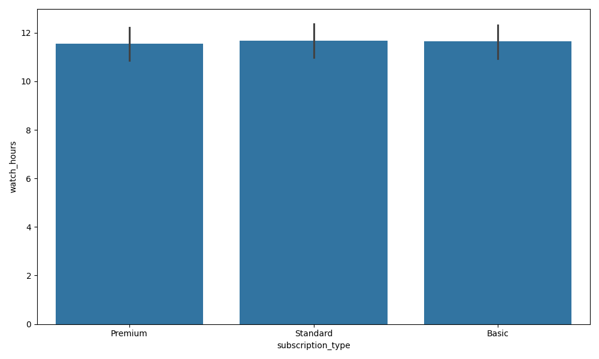
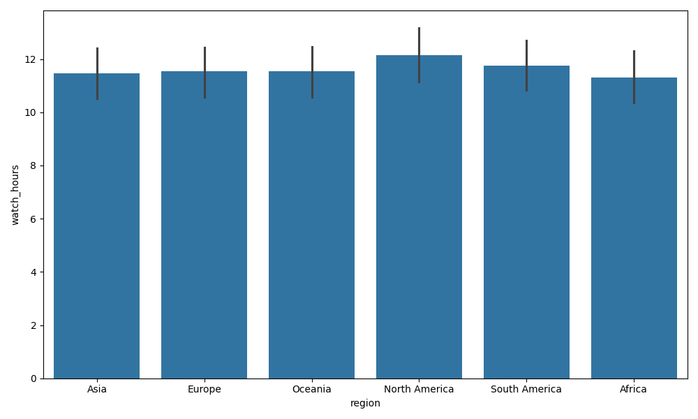
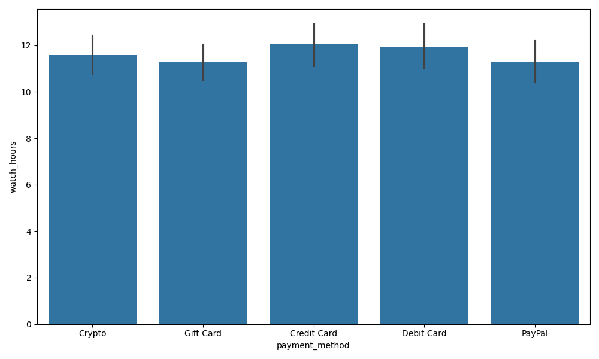

# 고객 이탈 EDA 및 모델별 성능 비교

## 🧾 EDA 개요

- target설정
- target:churned
- 필요 없는 컬럼 "customer_id"제거
- 데이터를 train/test로 분류
- 모델 학습은 train으로만 진행
- 각 feature에 대해서 수치형 데이터와 문자형(카테고리) 데이터로 분류
- 수치형 데이터 features: age, watch_hours, last_login_days, monthly_fee, number_of_profiles, avg_watch_time_per_day
- 문자형(카테고리) 데이터 features: gender, subscription_type, region, device, payment_method, favorite_genre
- 각 feature에 대한 상관관계를 파악 후 각 feature의 target에 대한 상관관계 분석 => 이탈자(churned)의 features를 파악해 이탈(churned)을 방지하기 위한 전략(마케팅, 서비스 개선 등)마련

## ⭐ 각 feature별 상관관계 heatmap

➡️ 이탈(churned)의 중요한 feature로 watch_hours(시청시간), last_login_days(마지막 로그인 후 경과일)

---

## 🧾 각 feature별 이탈(churned)비율

### 📊 gender, churned

️️️️️️️️➡️ gender에는 male, female, other가 있으며, other의 이탈률이 높게 나오나, 영향력이 작음

---

### 📊 subscription_type, churned

️️️️️️️➡️ 구독 유형에는 Basic, Premium, Standard가 있으며, Basic의 이탈률이 상당이 높게 나오고, 나머지는 이탈률이 적음

---

### 📊 region, churned

️️️️️️➡️ 아프리카와 북미에서는 이탈률이 적고, 유럽 아시아순으로 이탈률이 많이 발생함, 나머지 지역은 이탈률이 절반정도 됨

---

### 📊 device, churned

️️️️️➡️ 랩탑의 이탈률이 상당히 높음, 모바일과 TV에서는 이탈률이 살짝 높고, 데스크탑과 테블릿은 이탈률이 살짝 낮음

---

### 📊 payment_method, churned

️️️️️➡️ Crypto와 Gift Card의 이탈률이 상당이 높으며, Credit Card와 Debit Card는 이탈률이 상당이 낮으며, Paypal의 이탈률은 살짝 낮음

---

### 📊 favorite_genre, churned

️️️️️️️️️️➡️ 이탈률이 높은 장르: Action, Documentary, Drama, Horror

️️️️️️️️️➡️ 이탈률이 낮은 장르: Comedy, Romance, Sci-Fi

️️️️️️️️️➡️ 이탈률이 상당히 높은 장르: Horror, Action => 이 장르를 선호하는 고객에 대한 마케팅 및 서비스 개선 필요

---

## 🧾 각 category feature별 시청시간(watch_hours)비율

### 📊 subscription_type, watch_hours

️️️️️️️️️➡️ subscription_type에 대한 시청시간의 차이가 없음

---

### 📊 region, watch_hours

️️️️️️️️➡️ North America의 시청시간이 제일 많음

---

### 📊 payment_method, watch_hours

️️️️️️️️➡️ payment_method별 시청시간은 큰 차이가 없으나, Gift Card의 시청시간이 약간 적음